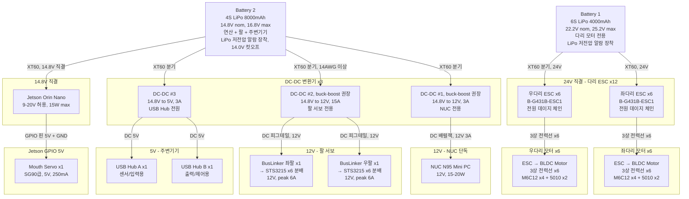

# HYlion Power Cables — 전원 배선도

2개 배터리에서 모든 부하로의 전원 분배 구성.

## Mermaid 다이어그램

## 전원 요약

### Battery 1 — 다리 전용 (6S LiPo 4000mAh, 22.2V)
| 부하 | 전압 | 연결 | 비고 |
|------|------|------|------|
| ESC ×6 좌다리 | 24V 직결 | XT60 | 데이지 체인 |
| ESC ×6 우다리 | 24V 직결 | XT60 분기 | 데이지 체인 |

### Battery 2 — 연산+팔+주변기기 (4S LiPo 8000mAh, 14.8V)
| 부하 | 전압 | 변환 | 연결 |
|------|------|------|------|
| Jetson Orin | 14.8V 직결 | 없음 (9-20V 허용) | XT60 |
| NUC N95 | 12V | DC-DC #1 (buck-boost, 3A) | DC 배럴잭 |
| BusLinker ×2 (팔 서보) | 12V | DC-DC #2 (buck-boost, 15A) | DC 피그테일 |
| USB Hub A + B | 5V | DC-DC #3 (3A) | DC 5V |
| Mouth Servo | 5V | Jetson GPIO | PWM + 5V + GND |

### 안전
- 양쪽 배터리에 LiPo 저전압 알람 장착
- Battery 2: 14.0V 컷오프
- NC 비상정지: Battery 1 차단 (Battery 2 유지, Orin 로그 보존)
