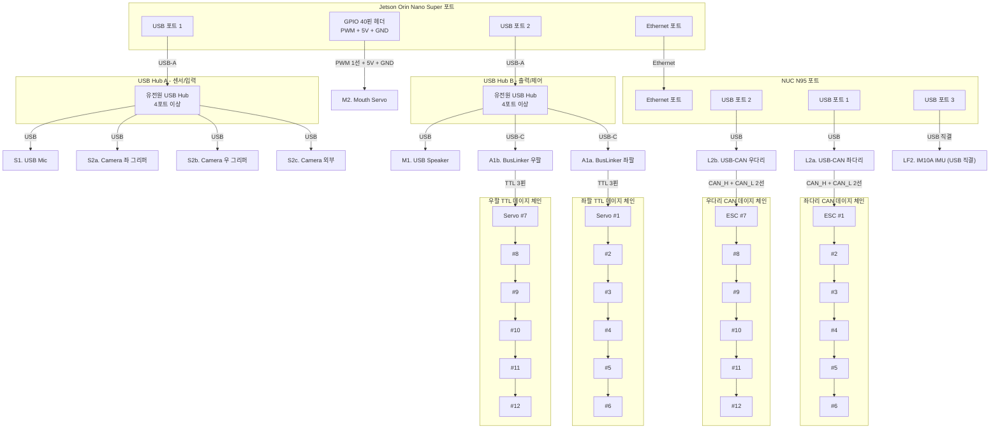

# HYlion Signal Cables — 신호 케이블 배선도

Orin과 NUC의 물리 포트별 연결 구성. USB Hub, CAN 데이지 체인, TTL 데이지 체인 포함.

## Mermaid 다이어그램

## 포트 배정 요약

### Jetson Orin Nano Super (USB 2개 + Ethernet + GPIO)
| 포트 | 연결 대상 | 케이블 |
|------|----------|--------|
| USB 1 | USB Hub A (센서) | USB-A |
| USB 2 | USB Hub B (제어) | USB-A |
| Ethernet | NUC N95 | CAT6 ~30cm |
| GPIO | Mouth Servo (SG90급) | PWM + 5V + GND |

### USB Hub A — 센서/입력 (5V from DC-DC #3)
| 포트 | 장치 |
|------|------|
| 1 | USB Microphone |
| 2 | Camera 좌 그리퍼 |
| 3 | Camera 우 그리퍼 |
| 4 | Camera 외부 (머리) |

### USB Hub B — 출력/제어 (5V from DC-DC #3)
| 포트 | 장치 | 케이블 |
|------|------|--------|
| 1 | USB Speaker | USB |
| 2 | BusLinker 좌팔 | USB-C |
| 3 | BusLinker 우팔 | USB-C |

### NUC N95 (3 USB + 1 Ethernet)
| 포트 | 연결 대상 | 하위 체인 |
|------|----------|----------|
| USB 1 | USB-CAN 좌다리 | → CAN 데이지 ESC #1~#6 |
| USB 2 | USB-CAN 우다리 | → CAN 데이지 ESC #7~#12 |
| USB 3 | IM10A IMU | USB 직결 (BHL 공식 권장, 브릿지 불필요) |
| Ethernet | Orin | UDP vx vy wz |
