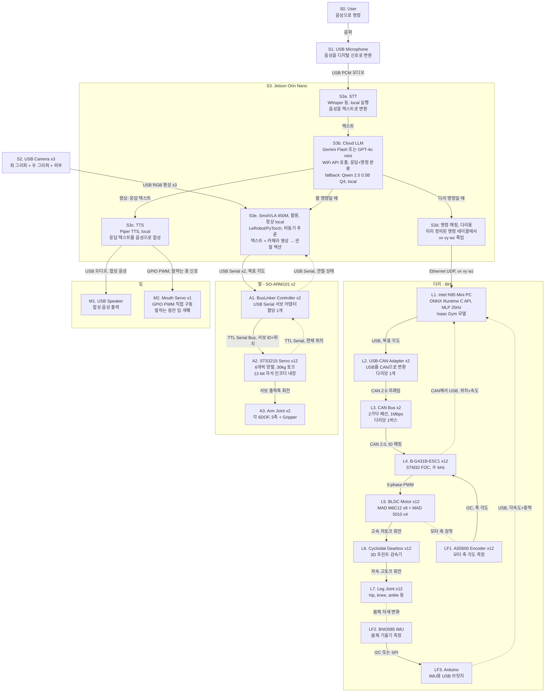

# HYlion Signal Flow — 전체 신호 흐름도

로봇의 센서 입력부터 액추에이터 출력까지의 전체 신호 흐름.

## Mermaid 다이어그램

## 신호 경로 요약

### 음성 대화 경로
User → USB Mic → **Orin Whisper STT (local)** → Cloud LLM (Gemini Flash / GPT-4o mini, fallback: Qwen 2.5 0.5B Q4 Ollama) → Piper TTS (local) → USB Speaker (ALSA/PulseAudio PCM) + 입 서보 (Jetson.GPIO PWM)

### 팔 조작 경로 (SmolVLA)
Cloud LLM (명령 분류) → **Orin SmolVLA 450M** (LeRobot/PyTorch, 비동기 추론) ← USB Camera ×3 (OpenCV)
→ BusLinker ×2 (LeRobot ServoControl, USB Serial) → STS3215 ×12 (TTL Bus) → 관절 ×12
← STS3215 위치 피드백 (TTL → USB)

### 다리 보행 경로 (Walking RL)
Cloud LLM (명령 분류) → Orin 명령 매핑 (YAML/JSON 테이블, vx vy wz 룩업) → UDP Client (Python)
→ **NUC** (UDP Server, udp_joystick.py 호환) → RL Policy (ONNX Runtime C API, MLP 25Hz, Isaac Gym 모델)
→ SocketCAN → USB-CAN ×2 → CAN Bus ×2 → ESC ×12 (Recoil-BESC, FOC 수kHz) → BLDC ×12 → 기어박스 ×12 → 관절 ×12
← AS5600 인코더 (I2C → ESC → CAN → NUC)
← BNO085 IMU (Arduino I2C/SPI → USB Serial → NUC)
