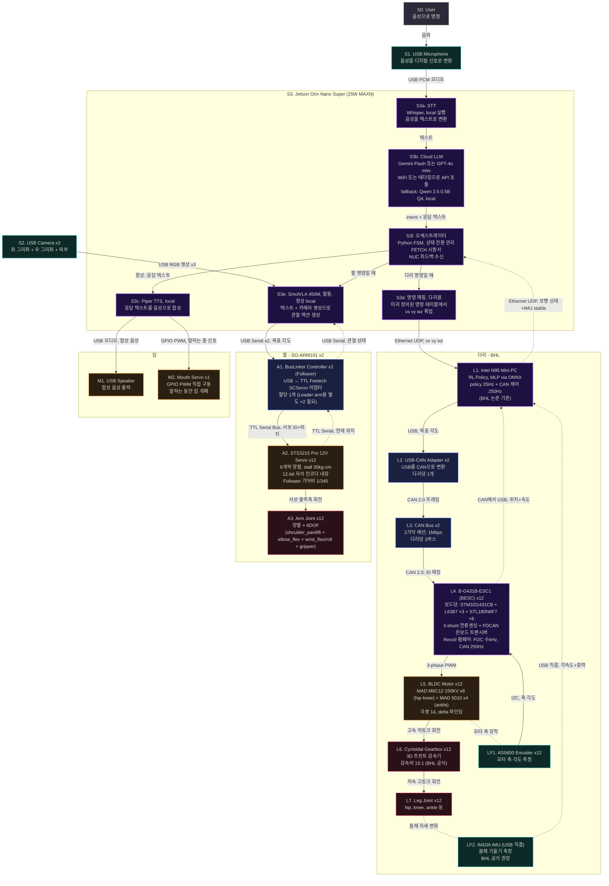

# Signal Flow

로봇의 센서 입력부터 액추에이터 출력까지의 전체 신호 흐름.

## 신호 경로 요약

### 음성 대화 경로
User → USB Mic → **Orin Whisper STT (local)** → Cloud LLM (Gemini Flash / GPT-4o mini) → 오케스트레이터 → Piper TTS (local) → USB Speaker + 입 서보 (GPIO PWM)

### 팔 조작 경로 (SmolVLA)
오케스트레이터 (팔 명령) → **SmolVLA 450M** (LeRobot/PyTorch) ← USB Camera ×3 (OpenCV)
→ BusLinker ×2 (USB Serial) → STS3215 ×12 (TTL Bus) → 관절 ×12
← 서보 위치 피드백 (TTL → USB)

### 다리 보행 경로 (Walking RL)
오케스트레이터 (다리 명령) → 명령 매핑 (YAML/JSON, vx vy wz) → UDP Client
→ **NUC** (UDP Server) → RL Policy (ONNX Runtime C API, MLP policy 25Hz — BHL 논문 기준; CAN 제어 루프 250Hz)
→ SocketCAN → USB-CAN ×2 → CAN Bus ×2 → ESC ×12 (Recoil-BESC, FOC) → BLDC ×12 → 기어박스 ×12 → 관절 ×12
← AS5600 인코더 (I2C → ESC → CAN → NUC)
← IM10A IMU (USB 직결 → NUC, BHL 공식 권장)
← NUC → Orin (UDP 보행 상태 + IMU stable)