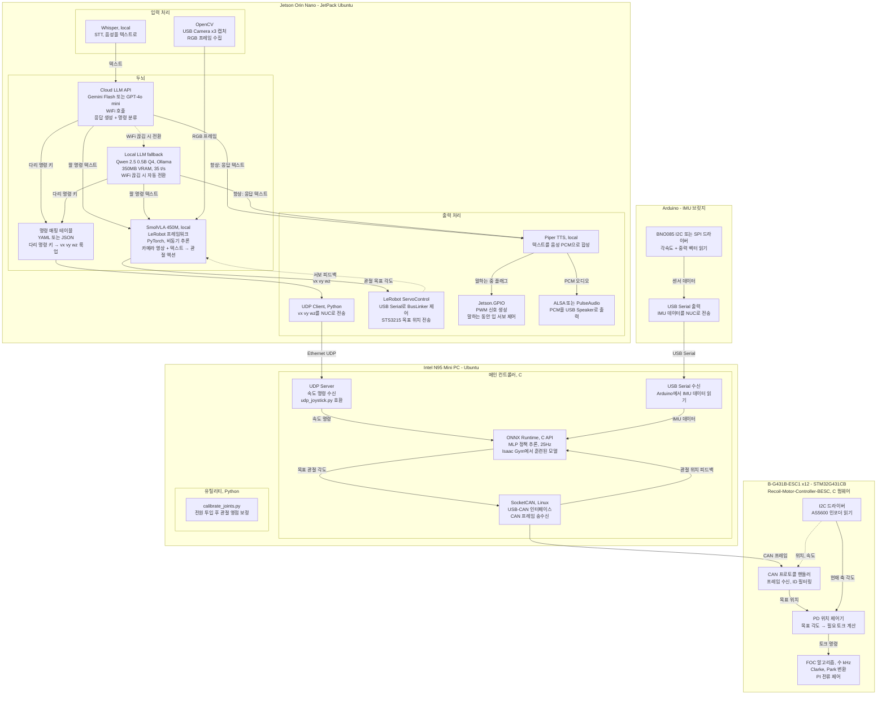

# HYlion Software Architecture — 소프트웨어 아키텍처

각 보드에서 실행되는 소프트웨어 스택과 데이터 흐름.

## Mermaid 다이어그램

## 소프트웨어 스택 요약

### Jetson Orin Nano (JetPack Ubuntu)
| 모듈 | 구현 | 역할 |
|------|------|------|
| OpenCV | Python | USB Camera ×3 캡처 |
| Whisper | Python, local | STT (음성→텍스트) |
| Cloud LLM | API 호출 | Gemini Flash / GPT-4o mini |
| Local LLM | Ollama | Qwen 2.5 0.5B Q4 (350MB VRAM, 35 t/s) |
| 명령 매핑 | YAML/JSON | 다리 명령 키 → vx vy wz |
| SmolVLA 450M | LeRobot/PyTorch | 카메라+텍스트 → 관절 액션 (비동기) |
| Piper TTS | Python, local | 텍스트 → 음성 PCM |
| UDP Client | Python | vx vy wz → NUC |
| LeRobot ServoControl | Python | USB Serial → BusLinker |
| Jetson.GPIO | Python | PWM → 입 서보 |
| ALSA/PulseAudio | System | PCM → USB Speaker |

### NUC N95 (Ubuntu)
| 모듈 | 언어 | 역할 |
|------|------|------|
| UDP Server | C | Orin에서 vx vy wz 수신 (udp_joystick.py 호환) |
| ONNX Runtime | C API | MLP policy 추론, 25Hz (Isaac Gym 모델) |
| SocketCAN | C (Linux) | USB-CAN → CAN 프레임 송수신 |
| USB Serial | C | Arduino에서 IMU 데이터 수신 |
| calibrate_joints.py | Python | 관절 영점 보정 유틸리티 |

### ESC — B-G431B-ESC1 ×12 (STM32G431CB)
| 모듈 | 역할 |
|------|------|
| Recoil-Motor-Controller-BESC | C 펌웨어 |
| FOC (수 kHz) | Clarke/Park 변환 + PI 전류 제어 |
| PD 위치 제어기 | 목표 각도 → 토크 |
| CAN 프로토콜 | 프레임 수신, ID 필터링 |
| I2C 드라이버 | AS5600 인코더 읽기 |

### Arduino — IMU 브릿지
| 모듈 | 역할 |
|------|------|
| BNO085 드라이버 | I2C/SPI로 각속도+중력 읽기 |
| USB Serial 출력 | IMU 데이터를 NUC로 전송 |
