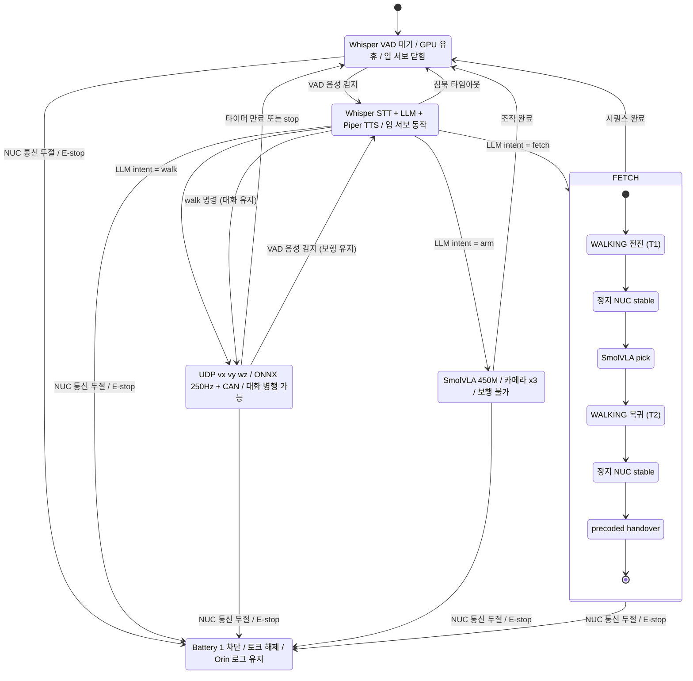

# State Machine

로봇의 상태 전환 다이어그램. 6개 상태와 전환 조건.

## 상태 요약

| 상태 | 설명 | 주요 리소스 |
|------|------|------------|
| IDLE | Whisper VAD 대기. GPU 유휴, 입 서보 닫힘 | Orin (대기), NUC lowlevel 대기 |
| TALKING | Whisper STT + LLM + Piper TTS. 입 서보 동작 | Orin GPU (STT/TTS) |
| WALKING | UDP로 NUC에 vx vy wz 전송. 대화 병행 가능 | NUC (ONNX 250Hz + CAN) |
| MANIPULATING | SmolVLA 450M 추론. 카메라 ×3 활성. 보행 불가 | Orin GPU (SmolVLA), BusLinker ×2 |
| FETCH 시퀀스 | 오케스트레이터가 WALKING/MANIPULATING을 순차 구동 | 전진→정지→pick→복귀→정지→handover |
| EMERGENCY | Battery 1 차단, 모터 토크 해제, 안전 주저앉음 | Orin 로그 유지 (Battery 2) |

## 전환 조건

| 출발 | 도착 | 트리거 |
|------|------|--------|
| IDLE | TALKING | VAD 음성 감지 |
| TALKING | IDLE | 침묵 타임아웃 |
| TALKING | WALKING | LLM intent = walk |
| TALKING | MANIPULATING | LLM intent = arm 명령 |
| TALKING | FETCH | LLM intent = fetch |
| WALKING | IDLE | 타이머 만료 또는 stop |
| WALKING | TALKING | VAD 음성 감지 (보행 유지) |
| TALKING | WALKING | 대화 중 walk 명령 (대화 유지) |
| MANIPULATING | IDLE | 조작 완료 |
| FETCH | IDLE | 시퀀스 완료 |
| IDLE / TALKING / WALKING / MANIPULATING / FETCH | EMERGENCY | NUC 통신 두절 또는 E-stop |
